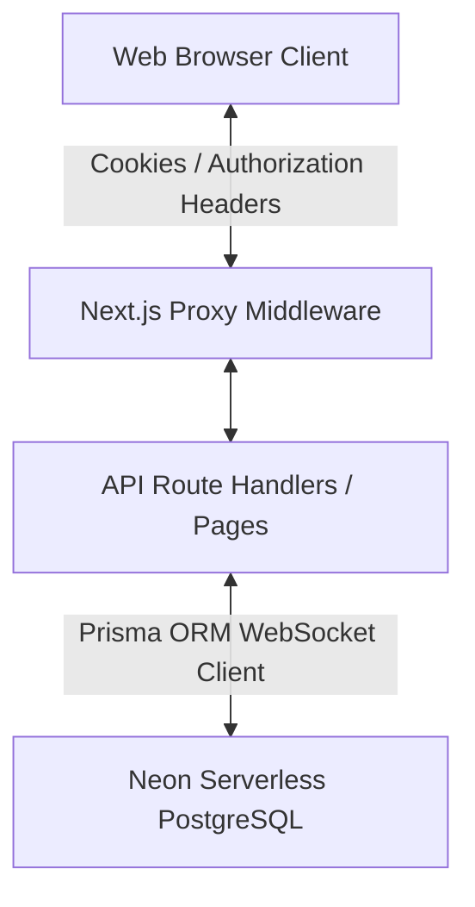
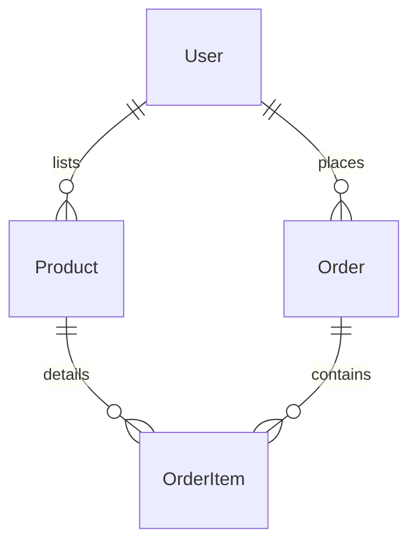

# AsaMed - Inventory & Order Management System

A premium, modern Inventory and Order Management System designed for chemical products, built using Next.js, Neon-hosted PostgreSQL, and Prisma. The application features a minimalistic beige/black aesthetic, strict server-side quantity and price conversions, and role-based access control for Admins, Sellers, and Buyers.

---

## 💻 Tech Stack & Architecture

- **Core Framework**: Next.js 16.2 (App Router, Turbopack)
- **Database**: Neon Serverless PostgreSQL (hosted in ap-southeast-1)
- **ORM**: Prisma Client v7.8.0
- **Database Client Adapter**: `@prisma/adapter-neon` with WebSockets (`ws`)
- **Styling**: Tailwind CSS & Vanilla CSS (Outfit Font design system)
- **Authentication**: JWT Session Signatures (`jose`) and PBKDF2 Password Hashing (via Node.js `crypto`)
- **Deployment**: Vercel

### High-Level System Design



1. **Routing Security**: All `/admin`, `/seller`, and `/buyer` pages are guarded by Next.js Proxy middleware. Cookies and Bearer tokens are decoded on the edge using `jose`.
2. **Server-Side Math Enforcement**: The database holds all stocks in their base units (e.g. Grams, Milliliters, Items). Price math and inventory deductions are executed atomically inside Prisma Transactions.

---

## 🛢️ Database Schema & Data Types

The Neon database schema leverages PostgreSQL's high-precision `Decimal` type to prevent float rounding errors:

### Key Tables & Field Definitions



#### `User` Model
- `id` (`String / CUID`): Primary key.
- `name` (`String`): User's display name.
- `email` (`String`): Unique email.
- `password` (`String`): PBKDF2 hash.
- `role` (`Role`): Enum (`ADMIN`, `SELLER`, `BUYER`).

#### `Product` Model
- `id` (`String / CUID`): Primary key.
- `name` (`String`), `sku` (`String / Unique`), `description` (`String / Optional`).
- `baseUnit` (`Unit`): Enum (`GRAM`, `MILLILITER`, `ITEM`).
- `stockQuantity` (`Decimal(20, 8)`): Available inventory count scaled to base unit.
- `basePrice` (`Decimal(20, 8)`): Stored unit rate per base unit.
- `sellerId` (`String?`): Optional foreign key to `User(id)` representing listing Seller.

#### `Order` Model
- `id` (`String / CUID`): Primary key.
- `userId` (`String`): Foreign key to `User(id)` (Buyer placing the quotation).
- `totalAmount` (`Decimal(20, 8)`): Calculated order total in INR.
- `status` (`OrderStatus`): Enum (`PENDING`, `APPROVED`, `REJECTED`, `COMPLETED`).

#### `OrderItem` Model
- `id` (`String / CUID`): Primary key.
- `orderId` (`String`), `productId` (`String`): Foreign keys.
- `orderedQuantity` (`Decimal(20, 8)`): Quantity requested by the buyer.
- `orderedUnit` (`Unit`): Display unit of selection (`GRAM`, `KILOGRAM`, `MILLILITER`, `LITER`, `ITEM`).
- `convertedQuantity` (`Decimal(20, 8)`): Stored base unit equivalent.
- `pricePerUnit` (`Decimal(20, 8)`): Unit rate in ordered unit.
- `subtotal` (`Decimal(20, 8)`): Calculated cost in INR.

---

## 📏 Unit Storage & Conversion Strategy

To preserve consistency, all inventory metrics are stored in their smallest dimensions:

| Dimension | User display unit | Stored base unit | Conversion Factor |
| :--- | :--- | :--- | :--- |
| **Weight** | Grams (g) | **GRAM (g)** | `1` |
| **Weight** | Kilograms (kg) | **GRAM (g)** | `1000` |
| **Volume** | Milliliters (mL) | **MILLILITER (mL)** | `1` |
| **Volume** | Liters (L) | **MILLILITER (mL)** | `1000` |
| **Count** | Items | **ITEM** | `1` |

### Math Logic & Scaling Rules

- **Client Input**: When a seller enters a product (e.g., `10 kg` at `₹450 / kg`), the server converts:
  - Base Stock: `10 kg * 1000 = 10,000 g`
  - Price per base unit: `₹450 / 1000 = ₹0.45 / g`
- **Quotation Calculations**: When a buyer requests `5 kg` of a product stored in grams:
  - Converted Qty: `5 * 1000 = 5000 g`
  - Price per ordered unit (kg): `Base Price (₹0.45) * 1000 = ₹450`
  - Subtotal: `5 * ₹450 = ₹2250`
- **Verification Rule**: The frontend displays real-time calculations, but **no client-side math is trusted**. The server queries the database, converts quantities, checks stock bounds, and computes subtotals during atomic transaction checkout.

### High-Precision & Minute Conversions

For highly valuable chemicals where minute quantities (e.g. `0.11111111223 g` or `0.000000000001 g`) cost a significant amount of money, standard floating-point representation causes severe rounding losses. To prevent this, we handle precision as follows:
1. **PostgreSQL Decimal(38, 16) Storage**: All numeric columns (`stockQuantity`, `basePrice`, `totalAmount`, `orderedQuantity`, `convertedQuantity`, `pricePerUnit`, and `subtotal`) are stored as `@db.Decimal(38, 16)` in the schema. This allocates 22 digits for whole numbers and guarantees exactly **16 decimal places of precision** stored natively in the database.
2. **JavaScript Big Decimal Handling**: Prisma Client maps these columns to JavaScript's high-precision `Decimal` wrapper (from `decimal.js`). All internal API checks, stock validation boundaries, and subtotal multipliers are executed using these high-precision numbers to bypass IEEE 754 float rounding bugs.

---

## 🧪 How to Test High-Precision Conversions

You can test this flow end-to-end to verify that extremely small fractions calculate rates and prices accurately without rounding down to zero:
1. **Log in as Admin** (`admin@asamed.com` / `admin123`) or a **Seller** (`seller1@asamed.com` / `seller123`).
2. **List a Valuable Chemical**:
   - Product Name: `Platinum Catalyzed Compound X-1`
   - SKU: `PT-CAT-X1`
   - Listing Unit: `GRAM`
   - Initial Stock: `10`
   - Price (INR): `9000000000` (₹9,000,000,000 / g)
3. **Log in as Buyer** (`buyer@asamed.com` / `buyer123`) or switch to the **Buyer Simulation** tab in the Admin panel.
4. **Order a Minute Quantity**:
   - Select `Platinum Catalyzed Compound X-1`.
   - Set the input unit to `GRAM`.
   - Input an extremely small decimal value: `0.11111111223`.
5. **Verify Subtotals**:
   - The UI and checkout calculations will display the exact subtotal: `0.11111111223 g * ₹9,000,000,000 = ₹1,000,000,010.07` INR.
   - Click **Submit Quotation**.
   - Check the **System Quotations Audit** (under the Admin dashboard `/admin` or Seller dashboard). You will see the exact requested quantity `0.11111111223 g`, its converted base value, and the precise subtotal preserved in the database down to the last decimal point.

---

## ⚙️ Setup & Installation

### Prerequisite Environment Variables
Create a `.env` file in the project root:
```env
DATABASE_URL="your-neon-db-url"
JWT_SECRET="aasa-med-super-secret-development-key-12345"
```
*(For production transactions, the direct Neon endpoint without `-pooler` is configured in `DATABASE_URL` to support Prisma interactive transactions.)*

### Run Locally
1. Clone the project.
2. Install dependencies:
   ```bash
   npm install
   ```
3. Generate Prisma client:
   ```bash
   npx prisma generate
   ```
4. Run the Next.js development server:
   ```bash
   npm run dev
   ```
5. Open [http://localhost:3000](http://localhost:3000) in your browser.

---

## 🚀 Vercel Deployment

The application is fully pre-configured for Vercel deployment:
1. Connect the GitHub repository to your Vercel Dashboard.
2. Configure **Environment Variables** in Vercel project settings:
   - Add `DATABASE_URL` and `JWT_SECRET`.
3. Set the build commands:
   - Build Command: `npm run build`
   - Install Command: `npm install`
4. Deploy the project. The build pipeline will automatically generate the Prisma client before bundling Next.js routes.

---

## 🔐 Test Login Credentials

Use the following pre-created test accounts to evaluate the application flows:

| Role | Email | Password | Panel URL | Capabilities |
| :--- | :--- | :--- | :--- | :--- |
| **Admin** | `admin@asamed.com` | `admin123` | `/admin` | Complete controls (Add/Remove users, delete catalog, approve/reject orders, simulate checkout). |
| **Seller 1** | `seller1@asamed.com` | `seller123` | `/seller` | List chemicals, manage stock, view and action orders *only for their products*. |
| **Seller 2** | `seller2@asamed.com` | `seller123` | `/seller` | Isolated merchant dashboard. Cannot see or manage Seller 1's products or orders. |
| **Buyer** | `buyer@asamed.com` | `buyer123` | `/buyer` | Search chemical catalog, select display units, add to cart, submit quotations, track status. |

---

## 🔍 Features Checklist & Implementation Audit

| Feature Requirement | Status | Verification Details |
| :--- | :---: | :--- |
| **Role-based Authentication** |  Verified | Secure HTTP-only cookies, jwt session check, proxy.ts router filters. |
| **INR Display Standards** |  Verified | All product listings, drawers, and request audit sheets formatted in HSL/Beige premium styled INR. |
| **High Decimal Precision** |  Verified | Prisma `Decimal` maps to PostgreSQL `numeric(20,8)` to prevent float loss. |
| **Flexible Conversion Units** |  Verified | Supports Grams, Kilograms, Milliliters, Liters, Items on catalog browses. |
| **Server-Side Math Enforcement** |  Verified | Price calculations and conversion bounds verified exclusively server-side during API orders. |
| **Atomic Deductions** |  Verified | Stock is deducted inside a `prisma.$transaction` block to prevent race conditions. |
| **Stock Refund on Reject** |  Verified | Changing order status to `REJECTED` automatically refunds stock base quantity. |
| **Seller Isolation** |  Verified | Sellers only see and edit their own products, and only manage quotation items belonging to them. |
| **Admin Control Center** |  Verified | Global user management (add/remove), catalog listing & deletion, order actions, and checkout simulation. |


DONE-DONE